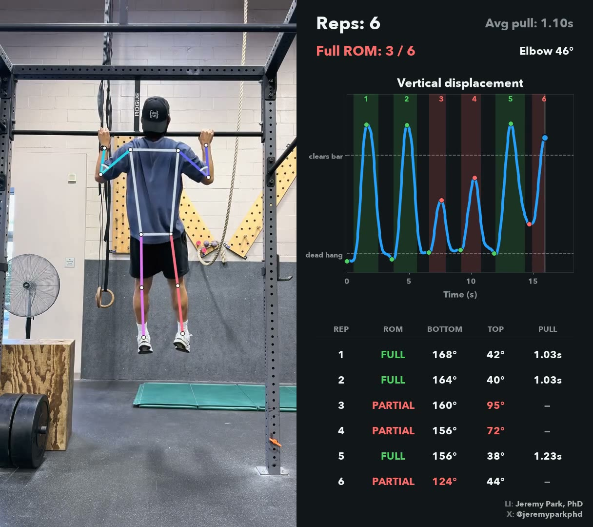

# vision-demos

Real-world computer vision demos.

| Project | What it does | Key model |
|---|---|---|
| **[dance_sync](dance_sync/)** | Compares dancers' sync performing the same choreography and computes a similarity metric. | [`vitpose-plus-large`](https://vlm.run/gateway/models/usyd-community-vitpose-plus-large) |
| **[chin_ups](chin_ups/)** | Counts chin-up reps from a clip and times the ascent and descent of each one. | [`vitpose-plus-large`](https://vlm.run/gateway/models/usyd-community-vitpose-plus-large) |
| **[pull_ups](pull_ups/)** | Counts pull-up reps, times each pull, and grades each rep's range of motion as full or partial against the athlete's own calibrated dead hang. | [`vitpose-plus-large`](https://vlm.run/gateway/models/usyd-community-vitpose-plus-large) |
| **[rock_climbing](rock_climbing/)** | Segments bouldering holds, returns which holds the climber used and in what order, and compares attempts at the same route. | [`sam3.1`](https://vlm.run/gateway/models/facebook-sam3.1) + [`vitpose-plus-large`](https://vlm.run/gateway/models/usyd-community-vitpose-plus-large) |
| **[rock_climbing_3d](rock_climbing_3d/)** | Reads the same route from a video recorded with depth (iPhone LiDAR), placing the wall, holds and climber in 3D and measuring the route in meters. | [`sam3.1`](https://vlm.run/gateway/models/facebook-sam3.1) + [`vitpose-plus-large`](https://vlm.run/gateway/models/usyd-community-vitpose-plus-large) |
| **[running](running/)** | Measures a runner's cadence, times every foot strike, and averages the knee shape at contact. | [`vitpose-plus-large`](https://vlm.run/gateway/models/usyd-community-vitpose-plus-large) |
| **[deadlift](deadlift/)** | Counts deadlift reps and classifies each rep's back as straight or rounded, with the probability. | [`sam3.1`](https://vlm.run/gateway/models/facebook-sam3.1) + [`vitpose-plus-large`](https://vlm.run/gateway/models/usyd-community-vitpose-plus-large) + [`gemma-4-26b-a4b-it`](https://vlm.run/gateway/models/google-gemma-4-26b-a4b-it) |

### Rock Climbing 3D

  
   
  <a href="https://www.youtube.com/watch?v=vjItC11jF0o">▶ Watch on YouTube</a>

### Dance Sync

  
   
  <a href="https://www.youtube.com/watch?v=Hmfwv0DwPeA">▶ Watch on YouTube</a>

### Chin-Ups

  

### Pull-Ups

  

### Rock Climbing

  

### Running

  

### Deadlift

  
   
  <a href="https://www.youtube.com/watch?v=917J5oOvcBM">▶ Watch on YouTube</a>

Each project has its own README with setup and instructions.

## License

[Apache-2.0](LICENSE).
